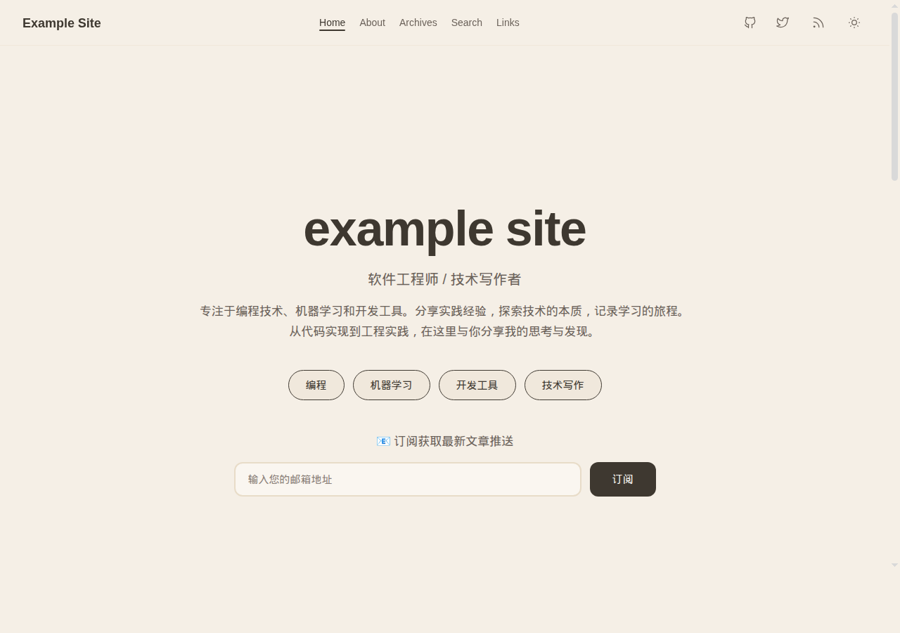
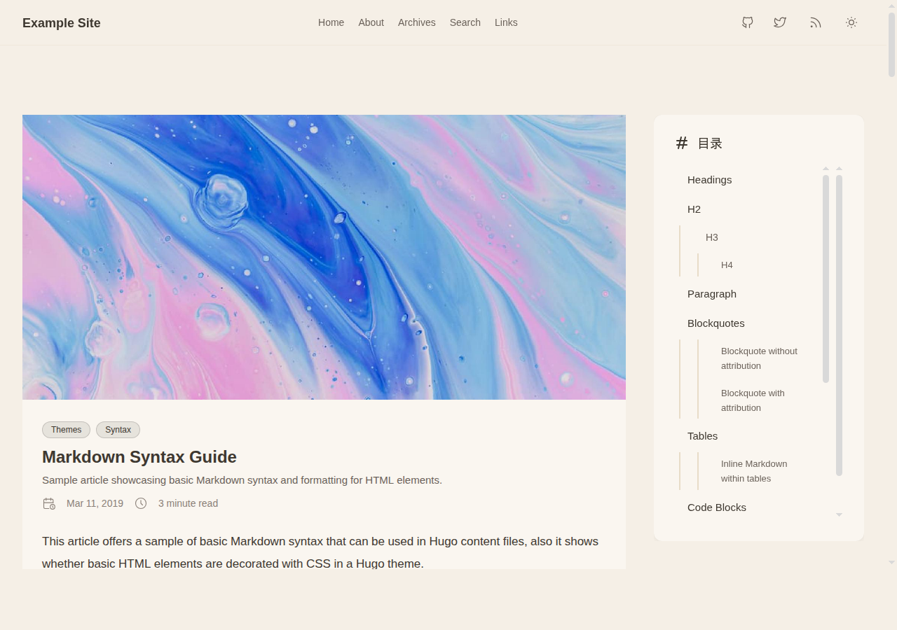

# 🍚 Fried Rice Theme

A warm, modern Hugo theme with earth-tone colors and flat design philosophy. Based on the excellent [Stack theme](https://github.com/CaiJimmy/hugo-theme-stack) by Jimmy Cai, Fried Rice brings a fresh, minimalist aesthetic with enhanced features.

## Screenshot





## ✨ Features

### 🎨 Design Philosophy
- **Warm Color Palette**: Rice-inspired earth tones (#F5EFE6 body, #FAF6F0 cards)
- **Flat Design**: Removed card borders and heavy shadows for a cleaner, modern look
- **Enhanced Typography**: Optimized font sizing and line heights for better readability
- **Responsive Layout**: Mobile-first approach with smooth breakpoint transitions

### 🚀 Enhanced Features
- **Table of Contents Sidebar**: Sticky TOC for easy navigation on article pages (desktop)
- **RSS Feed Integration**: Prominent RSS icon in header navigation
- **Newsletter Subscription**: Built-in Listmonk integration in hero section
- **Modern Pagination**: Accent-colored, button-style navigation
- **Improved Header**: Sun/moon theme toggle with consistent icon styling
- **6 Articles per Page**: Increased from default 5 for better content density

### 🔍 SEO & Performance
- Complete Open Graph support (Facebook, Twitter Cards)
- Canonical URLs and proper meta tags
- Enhanced Article/BlogPosting schema.org structured data with:
  - **keywords**: Merged from tags and categories
  - **articleSection**: Uses first category
  - **wordCount**: Built-in Hugo word count
  - **timeRequired**: Reading time in ISO 8601 format
  - **inLanguage**: Site language code
  - **author image**: Configurable author avatar
- RSS/Atom feeds
- Google Analytics integration
- Sitemap generation
- Fast build times with Hugo modules

## 📦 Installation

### Using Hugo Modules (Recommended)

1. Initialize Hugo modules in your project:
```bash
hugo mod init github.com/yourusername/your-blog
```

2. Add to your `config/_default/module.toml`:
```toml
[[imports]]
path = "github.com/Svtter/Fried-Rice"
```

3. Update dependencies:
```bash
hugo mod get -u
hugo mod tidy
```

### Using Git Submodule

```bash
git submodule add https://github.com/Svtter/Fried-Rice.git themes/fried-rice
```

Then add to your `config.toml`:
```toml
theme = "fried-rice"
```

## ⚙️ Configuration

### Basic Setup

```toml
# config/_default/config.toml
baseurl = "https://yourdomain.com"
languageCode = "zh-cn"  # or your language
title = "Your Blog Title"

[pagination]
pagerSize = 6

enableRobotsTXT = true

[outputs]
  home = ["HTML", "RSS", "JSON"]
```

### Theme Parameters

The theme inherits all Stack theme parameters. See the [Stack documentation](https://stack.jimmycai.com) for detailed configuration options.

### Hero Section Configuration

Customize the hero section on your homepage by adding the following to your `hugo.yaml` or `config.toml`:

```yaml
# hugo.yaml
params:
  hero:
    subtitle: "Agent Engineer / Software Engineer / Technical Writer"
    description: "Your custom description text here"
    topics:
      - Programming
      - Machine Learning
      - Dev Tools
      - Agent Engineer
      - Technical Writing
```

Or in TOML format:

```toml
# config.toml
[params.hero]
  subtitle = "Agent Engineer / Software Engineer / Technical Writer"
  description = "Your custom description text here"
  topics = ["Programming", "Machine Learning", "Dev Tools", "Agent Engineer", "Technical Writing"]
```

If these values are not set, the theme will use default i18n translations from the `i18n/` directory.

### Newsletter Integration (Optional)

To enable newsletter subscription in the hero section, edit `layouts/partials/hero/hero.html` with your Listmonk endpoint:

```html
<form action="https://your-listmonk-instance.com/subscription/form" method="post">
    <!-- Form fields -->
</form>
```

## 🎯 Key Differences from Stack

| Feature | Stack | Fried Rice |
|---------|-------|------------|
| Color Scheme | Blue accent | Warm earth tones |
| Card Style | Bordered with shadows | Flat, borderless |
| Pagination | Compact bar | Spaced buttons |
| TOC | In-content | Sticky sidebar |
| Header Icons | Toggle icons | Sun/moon + RSS |
| Articles per Page | 5 | 6 |
| Article Schema | Basic implementation | Enhanced with keywords, word count, reading time, and language support |

## 🛠️ Development

### Local Development

```bash
# Clone the repository
git clone https://github.com/Svtter/Fried-Rice.git

# Create a test site
hugo new site test-site
cd test-site

# Add theme as module
hugo mod init github.com/yourusername/test-site
echo '[[imports]]\npath = "github.com/Svtter/Fried-Rice"' > config/_default/module.toml

# Start development server
hugo server -D
```

### Building for Production

```bash
hugo --minify --gc
```

## 🌟 Live Demo

Visit [svtter.cn](https://svtter.cn) to see Fried Rice in action.

## 📝 Version History

- **v0.4.1** (2026-01-25)
  - Fix article tag visibility in dark mode

- **v0.4.0** (2026-01-20)
  - Dark mode redesign with three-layer surface system and accent glow effects
  - Updated Chinese fonts to Noto Sans SC and LXGW WenKai Screen
  - Added AI agent workflow configuration (OpenSpec framework)

- **v0.3.3** (2025-12-30)
  - Configurable hero section parameters for customization
  - Updated default subtitle and hero topic to Agent Engineer

- **v0.3.0** (2025-12-26)
  - Language switcher button for EN/ZH language switching
  - i18n translations for footer and hero sections

- **v0.2.0** (2025-12-23)
  - WebSite, Organization, and FAQ schema for better SEO
  - Article/BlogPosting schema enhancements with accessibility metadata

- **v0.1.0** (2025-12-21)
  - Initial fork from hugo-theme-stack
  - Table of contents sidebar for article pages
  - SEO optimizations with JSON-LD structured data
  - RSS icon and newsletter integration
  - Updated pagination style

## 🤝 Contributing

Contributions are welcome! Please feel free to submit a Pull Request.

## 📄 License

**Licensed under the GNU General Public License v3.0**

This theme is based on [Hugo Theme Stack](https://github.com/CaiJimmy/hugo-theme-stack) by Jimmy Cai.

### Credits

- Original Stack theme: [Jimmy Cai](https://jimmycai.com)
- Fried Rice redesign: [svtter](https://svtter.cn)
- Icons: [Tabler Icons](https://tabler-icons.io/)

## 🔗 Links

- **Repository**: [github.com/Svtter/Fried-Rice](https://github.com/Svtter/Fried-Rice)
- **Author**: [svtter.cn](https://svtter.cn)
- **Base Theme**: [Hugo Theme Stack](https://github.com/CaiJimmy/hugo-theme-stack)
- **Hugo**: [gohugo.io](https://gohugo.io)

---

Made with ❤️ and 🍚
